# Clause

Clause is a web application for interrogating legal contracts. Users upload PDF and DOCX files, ask questions in natural language, and receive answers where every factual claim is backed by an exact, server-verified quotation located by character offset in the original document.

The quote-verification engine rejects hallucinations: every `<cite>` tag the model emits is matched against the raw extracted text using a case- and whitespace-insensitive search. A citation is marked verified only when the quote is found verbatim. A citation that the model fabricated — text not present in the document — is marked unverified and displayed in a distinct visual state.

---

## Screenshots

| | |
|---|---|
| 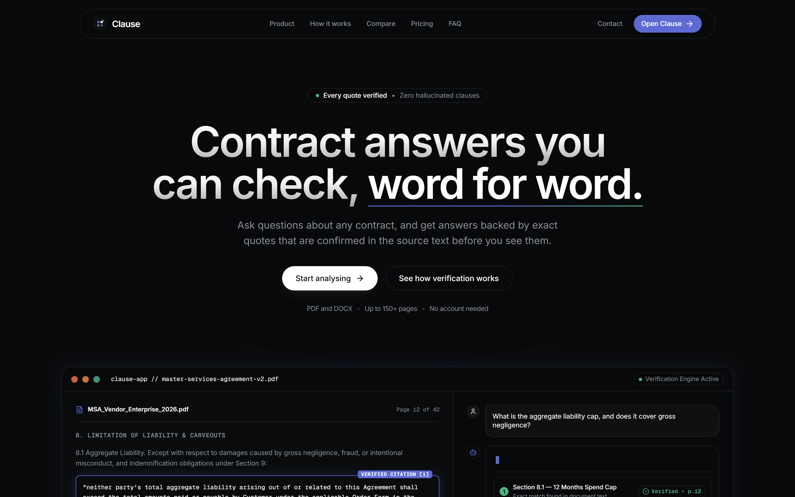 | 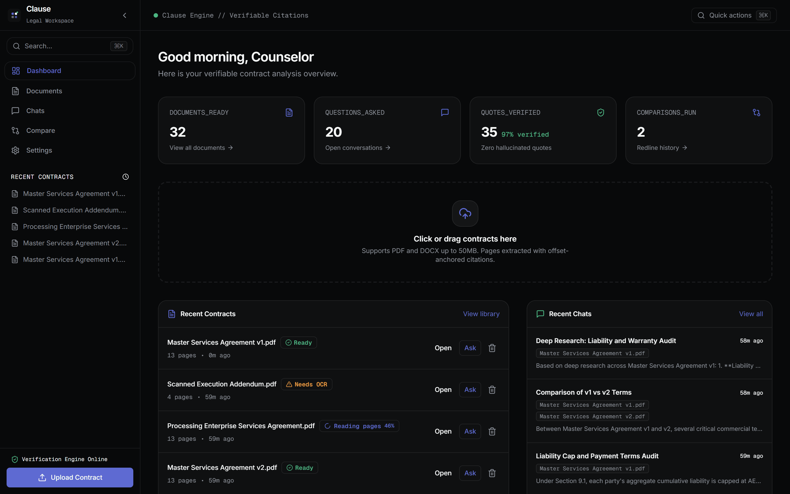 |
| 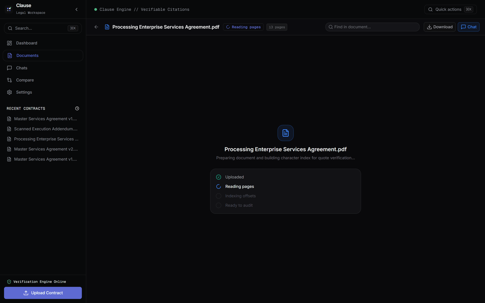 | 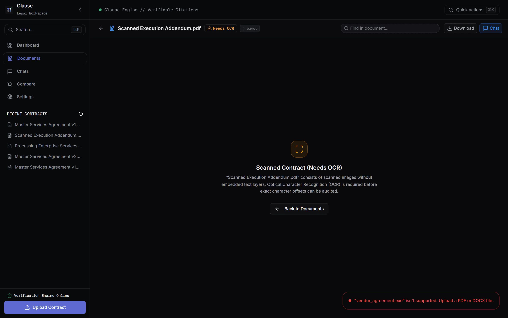 |
| 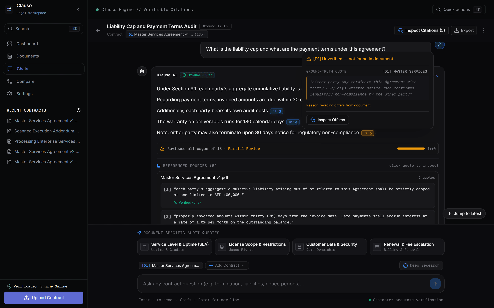 | 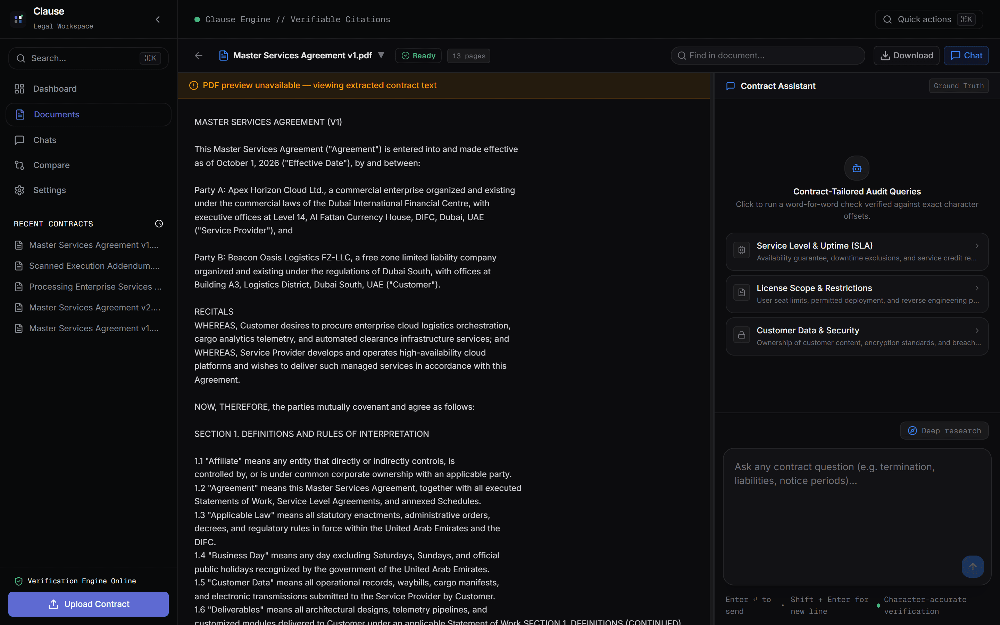 |
| 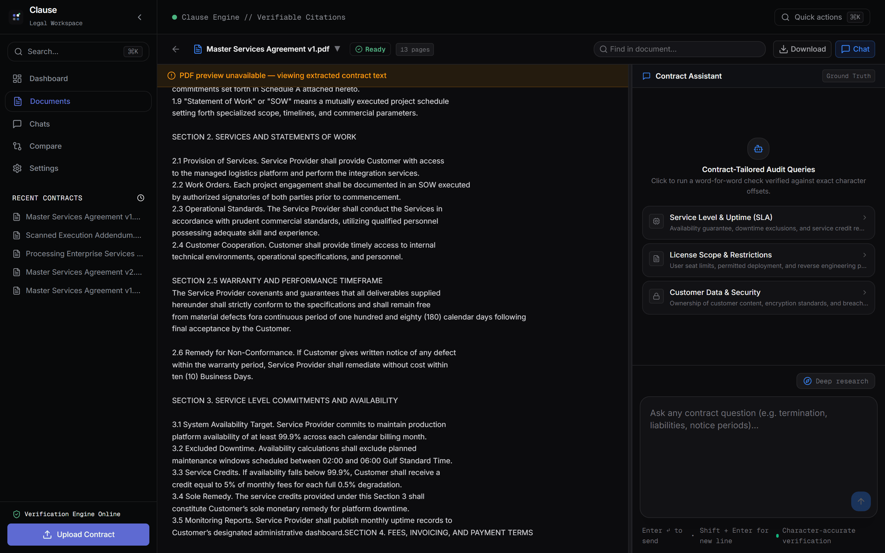 | 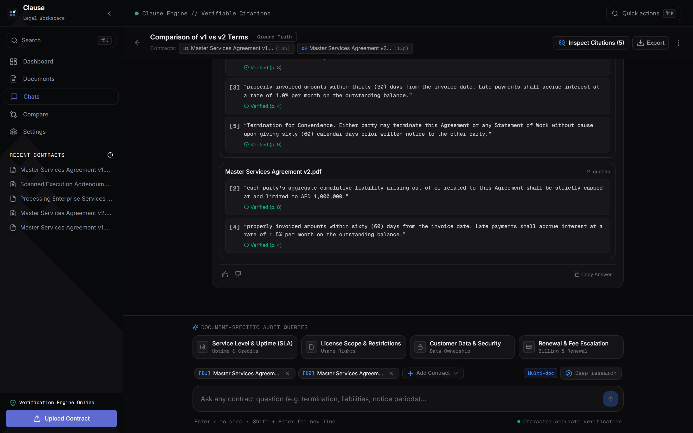 |
| 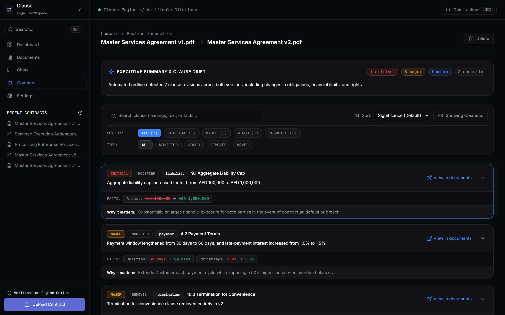 | 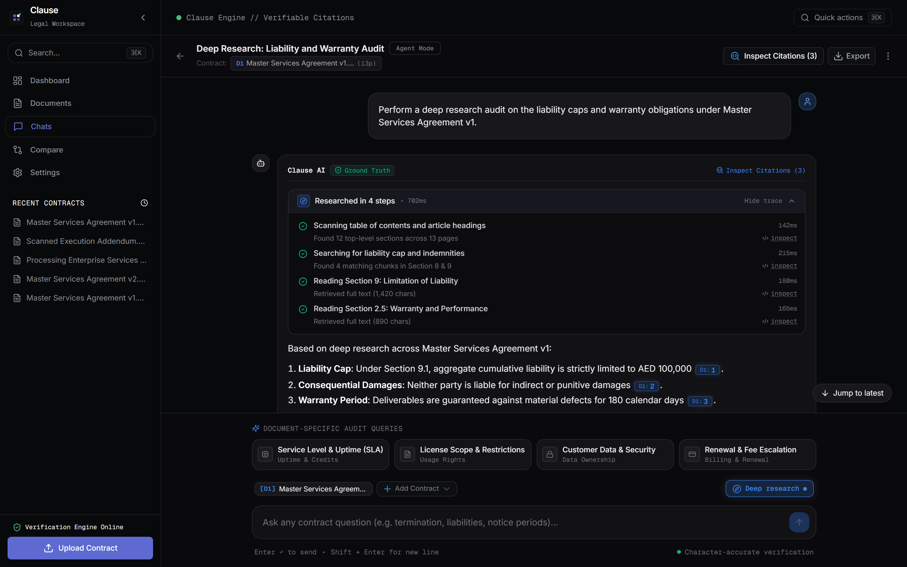 |
| 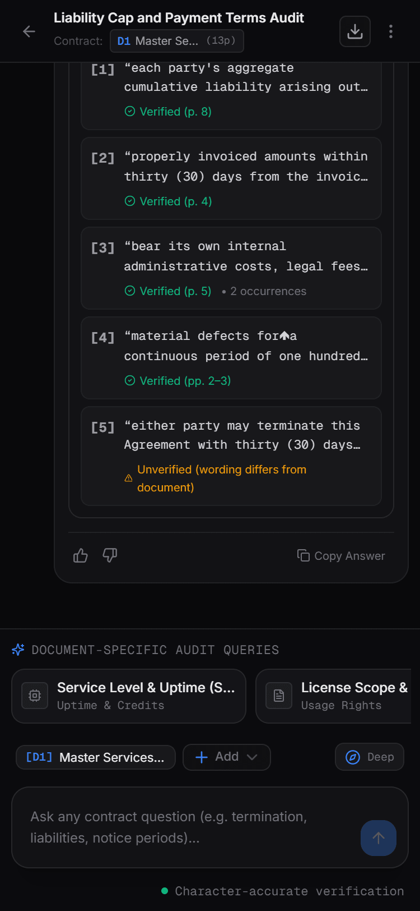 | |

---

## Features

### Document ingestion
- PDF extraction via `pdfjs-dist`. Text, page boundaries, and byte offsets are stored for every page.
- DOCX extraction via `mammoth`. DOCX files are converted to plain text and given synthetic page boundaries.
- Scanned PDFs (no selectable text) are detected and rejected with a clear message. Users are told to provide a text-based version.
- Files are stored using Vercel Blob. The document status progresses through `UPLOADING → QUEUED → EXTRACTING → INDEXING → READY`.
- After extraction the full text is split into overlapping chunks. Each chunk records its heading (detected from numbering patterns), start offset, end offset, and page range.

### Chat and quote verification
- Conversations are scoped to one or more documents. Each document gets a short label (D1, D2, ...) that the model uses in `<cite doc="D1">` tags.
- The model is instructed to cite every factual claim using a verbatim quote of 8–60 words. It must never paraphrase inside a cite tag and must never guess when the excerpts do not contain the answer.
- The server parses the model's streamed output using `CiteStreamParser`, a resilient state machine that handles arbitrary chunk boundaries and unclosed tags at end-of-stream.
- After parsing, `findQuote` runs a normalised search (lowercased, whitespace-collapsed) against the document's `fullText`. The result records: `verified` boolean, `matchCount`, and the `[startOffset, endOffset]` and `[pageStart, pageEnd]` of every match.
- Citations are stored in the database. On subsequent loads the UI renders each citation with a coloured chip: green for verified, red for unverified.

### Retrieval strategy
- Short documents (≤ 12 pages): the full text is sent to the model as context.
- Medium documents: a keyword search over chunks selects the most relevant sections, supplemented by heading-level expansion to include the full clause when a partial chunk is retrieved.
- Large documents: full-document retrieval is used with a sliding-window context budget.
- The strategy used and the pages covered are stored on each message and displayed to the user as a coverage badge.

### Document viewer with citation highlighting
- The `/documents/[id]` route shows a resizable two-pane layout: PDF viewer on the left, chat on the right.
- The PDF is rendered page-by-page using a canvas element via `pdfjs-dist`. A transparent overlay is positioned above each canvas for highlight rectangles.
- When a citation is active, the viewer scrolls to the first match, draws a highlight rectangle, and if the citation spans more than one match it shows a "Match N of N" counter.
- Cross-page citations are supported: the highlight is rendered on each page the quote spans.

### Multi-document questions
- A conversation can include multiple documents. The document picker in the chat composer accepts multi-select with search and chip display.
- Retrieval runs per-document. The context budget is split proportionally. Excerpts are labelled by document (D1, D2, ...).
- The model is instructed to organise multi-document answers by topic and to compare across documents rather than list them separately.

### Redline comparison
- Two documents can be compared side by side. The comparison pipeline segments both documents, aligns corresponding sections, computes character-level diffs, classifies each change (CRITICAL / MAJOR / MINOR / COSMETIC), and extracts structured facts (amounts, durations, percentages).
- Changes are displayed as a filterable list. Each change shows the before/after text, a plain-English summary, and a "why it matters" explanation.

### Agentic deep research
- Conversations can be set to AGENT mode using the "Deep research" toggle in the chat composer.
- In agent mode the model calls tools instead of receiving a pre-built prompt: `list_clauses`, `search_document`, `get_section`, `get_pages`, `list_documents`, `compare_sections`.
- Each tool call is recorded in a structured trace stored on the message. The UI renders this trace as a collapsible timeline showing the tool name, a human-readable label, duration, and result summary.

---

## Architecture

```
Browser
  └─ Next.js 15 (App Router, React 19)
       ├─ /api/upload          → Vercel Blob upload, Job queue
       ├─ /api/ingest/[id]     → Extraction → Chunking → Status updates
       ├─ /api/chat/[id]       → SSE stream: retrieval → prompt → cite-parse → verify → persist
       ├─ /api/agent/[id]      → SSE stream: tool-call loop → cite-parse → verify → persist
       ├─ /api/compare/[id]    → Comparison pipeline (segment → align → diff → classify → facts)
       └─ /api/documents/[id]/file → Proxy to Vercel Blob for PDF.js

Database (PostgreSQL via Prisma)
  Document → DocumentPage → Chunk
  Conversation → ConversationDocument (label D1, D2, ...)
  Message → Citation (verified, matchCount, startOffset, endOffset, pageStart, pageEnd, allMatches)
  Comparison → ComparisonChange
  Job (ingestion queue)
```

### Key library modules

| Path | Responsibility |
|---|---|
| `lib/extract/pdf.js` | PDF text and page boundary extraction |
| `lib/extract/docx.js` | DOCX to plain text |
| `lib/chunking/index.js` | Heading-aware chunking with offsets |
| `lib/retrieval/` | Strategy selection, search, context packing |
| `lib/ai/cite-parser.js` | Streaming `<cite>` tag parser |
| `lib/verify/quotes.js` | `findQuote`: normalised search, offset resolution |
| `lib/highlight/` | Offset-to-canvas-coordinate mapping for PDF.js |
| `lib/compare/` | Segmentation, alignment, diff, classification, facts |
| `lib/agent/` | Tool definitions (Zod schemas + handlers), run loop |

---

## Getting started

### Prerequisites

- Node.js 20 or later
- PostgreSQL (tested against Neon)
- An OpenAI-compatible API key and base URL
- A Vercel Blob token

### Installation

```bash
git clone <repo>
cd Clause
npm install
```

Copy the example environment file and fill in your secrets:

```bash
cp .env.example .env
```

Required variables:

```
DATABASE_URL=postgresql://...
DIRECT_URL=postgresql://...
BLOB_READ_WRITE_TOKEN=...
AI_API_KEY=...
AI_BASE_URL=https://api.groq.com/openai/v1
AI_MODEL=openai/gpt-oss-120b
AI_FAST_MODEL=openai/gpt-oss-20b
```

Run migrations and start the development server:

```bash
npm run db:migrate
npm run dev
```

Open [http://localhost:3000](http://localhost:3000).

### Demo data

To populate the database with two sample contracts, several conversations, a finished comparison, and an agent conversation:

```bash
# Generate the sample PDFs (stored in docs/sample-contracts/)
npm run samples:generate

# Seed the database (idempotent)
npm run seed:demo
```

### Screenshots

```bash
# Requires the dev server to be running and the demo data to be seeded
npm run screenshots
```

Output goes to `docs/screenshots/`. The script uses Playwright in headless mode and compresses each image with Sharp.

---

## Tests

```bash
npm test
```

The test suite has 23 files and 113 tests. All pass. Tests cover:

- PDF extraction and the mathematical offset invariant: `fullText.slice(startOffset, endOffset) === page.text` for every page
- Chunking boundaries and heading detection
- Retrieval strategy selection and context packing
- Citation parsing including edge cases (unclosed tags, multi-chunk splits)
- Quote verification including normalisation, cross-page spans, and duplicate-match counting
- Highlight coordinate mapping from character offsets to PDF canvas pixels
- Comparison pipeline: segmentation, alignment, diff, classification, fact extraction
- Agent tool schemas and handlers
- Chat stream integration
- API endpoint tests for health, waitlist, contact, dashboard, and suggestions

---

## Deployment

The application is deployed on Vercel. The build command is `prisma generate && prisma migrate deploy && next build`.

Live: [https://clause-dusky-phi.vercel.app](https://clause-dusky-phi.vercel.app)

---

## Not done

- **OCR**: documents detected as image-only are rejected with a clear message, but no OCR pipeline is implemented.
- **Real-time ingestion progress**: progress is polled by the client every two seconds rather than pushed over a persistent connection.
- **Background workers**: the `Job` table implements a queue schema, but the ingestion worker runs inside the same Next.js serverless function. Very large documents may hit the function timeout.
- **DOCX viewer**: DOCX files are extracted and searchable in chat, but the document viewer renders only PDFs. A DOCX upload shows a placeholder in the viewer pane.
- **Authentication**: all data is shared within a single tenant. There is no user account system.
